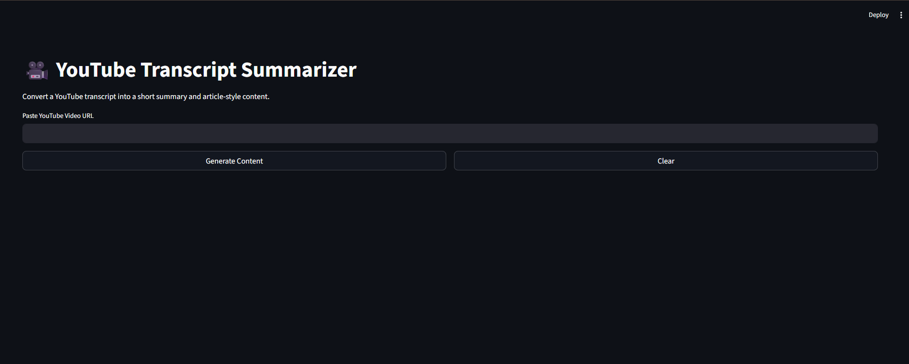
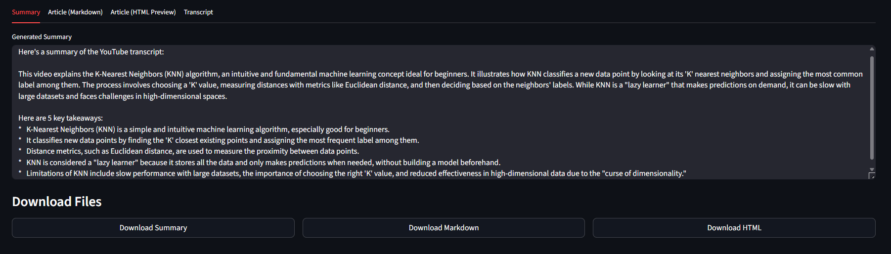
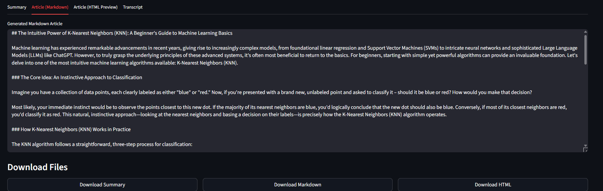

# 🎥 YouTube Transcript Summarizer (GenAI Project)

A production-ready Generative AI application that transforms YouTube video content into concise summaries and structured, publication-ready articles using Large Language Models.

This project demonstrates an end-to-end AI pipeline for **content understanding, summarization, and transformation**, making it suitable for real-world applications like blogging, knowledge extraction, and content repurposing.

---

## 🚀 Key Features

* 📺 Extract transcripts directly from YouTube videos
* ✂️ Clean and preprocess raw textual data
* 🧠 Generate high-quality summaries (5–7 lines + key insights)
* 📝 Convert transcripts into well-structured articles (Markdown + HTML)
* 🌐 Interactive and user-friendly UI using Streamlit
* 📥 Export outputs in multiple formats (TXT, Markdown, HTML)

---

## 🛠️ Tech Stack

* **Python**
* **Streamlit** – Interactive UI
* **YouTube Transcript API** – Data extraction
* **Google Gemini API** – LLM-based generation
* **Markdown** – Content formatting

---

## 📸 Screenshots

### 🔹 Application Interface



### 🔹 Generated Summary



### 🔹 Article Preview



---

## ⚙️ Installation & Setup

```bash
git clone https://github.com/Anjiembadi/youtube-summarizer-genai.git
cd youtube-summarizer-genai
python -m venv venv
venv\Scripts\activate   # Windows
pip install -r requirements.txt
```

---

## 🔑 Environment Configuration

Create a `.env` file in the root directory:

```env
GEMINI_API_KEY=your_api_key_here
```

---

## ▶️ Run the Application

```bash
python -m streamlit run streamlit_app.py
```

---

## 🧠 System Workflow

1. Accept YouTube video URL from user
2. Extract transcript using API
3. Perform text cleaning and preprocessing
4. Apply prompt engineering with LLM to:

   * Generate concise summary
   * Generate structured article
5. Render results in UI
6. Provide downloadable outputs

---

## 📂 Output Artifacts

* `summary.txt` → concise summary
* `article.md` → structured markdown article
* `article.html` → browser-ready article

---

## 🎯 Use Cases

* Content repurposing for blogs and articles
* Learning and knowledge summarization
* Educational content extraction
* Documentation generation from videos

---

## 🔮 Future Enhancements

* 🌍 Multi-language summarization
* ⏱️ Timestamp-based segmented summaries
* ☁️ Deployment (Streamlit Cloud / Hugging Face Spaces)
* 🏷️ AI-driven tagging and SEO optimization
* 📊 Analytics on content themes

---

## 👨‍💻 Author

**Embadi Anji**
GitHub: https://github.com/Anjiembadi

---

## ⭐ Support

If you found this project useful, consider giving it a star ⭐ on GitHub!
